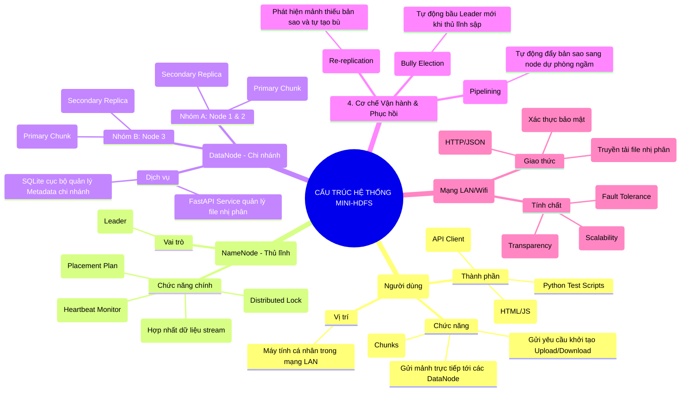

# SƠ ĐỒ KIẾN TRÚC HỆ THỐNG LƯU TRỮ PHÂN TÁN (MINI-HDFS)

> [!TIP]
> Bạn có thể xem hình vẽ trực quan bằng cách mở file này trong trình xem Markdown có hỗ trợ Mermaid (như VS Code, GitHub) hoặc copy đoạn code bên dưới dán vào [Mermaid Live Editor](https://mermaid.live).

---

## Giải thích chi tiết theo phong cách của sơ đồ mẫu:

### 1. Tầng Client (Người dùng)
*   **Thành phần:** Giao diện Web (Dashboard), Swagger UI hoặc các Script Python.
*   **Chức năng:** Khác với hệ thống tập trung, Client ở đây đóng vai trò chủ động trong việc "chặt" file lớn thành các mảnh nhỏ và gửi đi theo mẻ lưới.

### 2. Tầng Điều phối (NameNode)
*   **Vai trò:** Là "Nhạc trưởng" của hệ thống. 
*   **Chức năng:** Không trực tiếp giữ file mà chỉ giữ "Sổ đỏ" (Bản đồ vị trí file). Nó tính toán xem máy nào đang rảnh (CPU thấp, ổ cứng trống nhiều) để chỉ định lưu trữ.

### 3. Tầng Dữ liệu (DataNodes)
*   **Thành phần:** Các Laptop/Server đóng vai trò như các Chi nhánh kho bãi.
*   **Tự trị:** Mỗi chi nhánh có một két sắt riêng (Mysql/Sql Server) để lưu nhật ký mảnh tệp của mình.

### 4. Cơ chế kết nối & Vận hành
*   **Tính chịu lỗi (Fault Tolerance):** Nếu một máy chi nhánh "cành tạch" (hỏng ổ cứng/rút điện), dữ liệu vẫn an toàn vì luôn có ít nhất một bản sao nằm ở máy khác.
*   **Tính mở rộng (Scalability):** Muốn hệ thống mạnh hơn, chỉ cần cắm thêm máy mới vào mạng LAN và khai báo IP, không cần cài đặt lại từ đầu.
